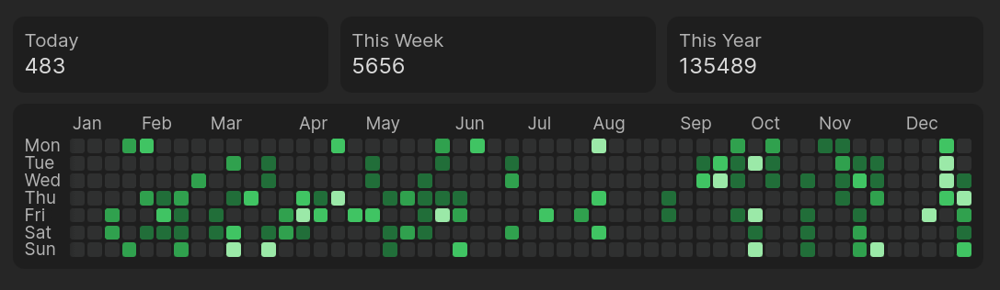

# Keep the Rhythm

Keep the Rhythm is an Obsidian plugin that helps you maintain a consistent writing practice by tracking your daily word count and visualizing it through an elegant heatmap. See your writing patterns at a glance and stay motivated to maintain your writing rhythm.

## Features

- **Daily Word Count Tracking**: Automatically tracks how many words you write each day in Obsidian
- **Visual Heatmap**: Data visualization showing your writing activity over time
- **Progress at a Glance**: Quickly see your most productive writing days and identify patterns in your writing habits
- **Privacy-Focused**: All data is stored locally within your Obsidian vault

## Installation

- Download the latest release files from this repository's Releases section
- Create a folder on `/.obsidian/plugins/` name `keep-the-rhythm`
- Reload Obsidian
- Go to Settings > Community Plugins and enable "Keep the Rhythm"

## Usage

Once installed and enabled, Keep the Rhythm will automatically begin tracking your writing activity. To view your heatmap:

1. Click the Keep the Rhythm icon in the left sidebar
2. The heatmap will display in the right panel, showing your writing activity
3. Hover over any day to see the exact word count
4. Click on a day to see detailed statistics

## Data and Privacy

Keep the Rhythm stores all data locally in your Obsidian vault. No data is sent to external servers. Your writing statistics are saved in a JSON file within the plugin's data directory.

## License

[MIT License](LICENSE)

## Support

If you encounter any issues or have suggestions for improvements, please:

1. Check the [GitHub Issues](https://github.com/yourusername/keep-the-rhythm/issues) to see if your issue has already been reported
2. Create a new issue if needed, providing as much detail as possible
